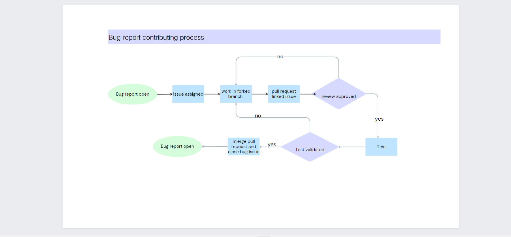

# Contributing

From opening a bug report to creating a pull request: every contribution is appreciated and welcome.

If you're planning to implement a new feature or change this repository, please [create an issue](https://github.com/websoft9/docker-library/issues/new/choose) first. This way we can ensure that your precious work is not in vain.

## Quick start for contributing new application

Below is the steps for contributing new application:  

1. Create issue by template **New docker compose request**
2. Waiting for Maintainers/owner Assessment until it is completed.
3. Install Websoft9 at your server or apply online development account from Websoft9
4. SSH to develoment host machine and running below command to upgrade latest Apps listing
   ```
   docker exec -it websoft9-apphub apphub upgrade apps --dev
   ```
5. Login to Websoft9 Console and install this application from **App Store**
6. Develop and test it by **[App compose](https://support.websoft9.com/en/docs/next/app-compose/)** at Websoft9 Console
7. Complete your issue checklist
8. Docker exec **websoft9-apphub** container and pull request to repository
   ```
   # sample for your, --appid get from Websoft9 Console, it not appname
   docker exec -it websoft9-apphub  apphub commit --appid "wordpress_o2qjz" --github_token "yourgithubtoken"
   ```

## Process diagram

[Bug report flow](https://www.canva.cn/design/DAFrBuGNCNs/-WGd-D0mQHBu1eZM07d8vQ/edit) as following:



[Feature request flow](https://www.canva.cn/design/DAFrBuGNCNs/-WGd-D0mQHBu1eZM07d8vQ/edit) as following:


## Development Specification

If you want to start to develop this repository, it is very useful for you to read [the develop documentation](docs/code_owner.md)

## Branch

This repository have these branchs:

- **dev branch**: Contributor only allow to fork [dev branch](https://github.com/Websoft9/docker-library/tree/dev) and pull request for it. 
- **main branch**: It is expected to contain code that is stable and ready for deployment.

> Maintainers/owner don't accept any pr to **main branch** from developer directly.

## Pull request

[Pull request](https://docs.github.com/pull-requests) let you tell others about changes you've pushed to a branch in a repository on GitHub.

#### When is PR produced?

- Contributor commit to dev branch

#### How to deal with PR?

1. [pull request reviews](https://docs.github.com/en/pull-requests/collaborating-with-pull-requests/reviewing-changes-in-pull-requests/about-pull-request-reviews)
2. Merge RP and CI/CD for it

## DevOps principle

DevOps thinks the same way **[5m1e](https://www.dgmfmoldclamps.com/what-is-5m1e-in-injection-molding-industry/)** for manufacturing companies

We follow the development principle of minimization, rapid release

### Version

Use _[[major].[minor].[patch]](https://semver.org/lang/zh-CN/)_ for version serial number and [version.json](../version.json) for version dependencies

### Artifact

Websoft9 use below [Artifact](https://jfrog.com/devops-tools/article/what-is-a-software-artifact/) for different usage:

- **Dockerhub for image**: Access [Websoft9 docker images](https://hub.docker.com/u/websoft9dev) on Dockerhub
- **Azure Storage for files**: Access [packages list](https://artifact.azureedge.net/release?restype=container&comp=list) at [Azure Storage](https://learn.microsoft.com/en-us/azure/storage/storage-dotnet-how-to-use-blobs#list-the-blobs-in-a-container)

### Tags

- Type tags: RRD, Bug, enhancement, Documetation
- Stages Tags: S-develop, S-fixed and all tags started with `S-`

### WorkFlow

Websoft9 use the [Github flow](https://docs.github.com/en/get-started/quickstart/github-flow) for development collaboration

## licensing

See the [LICENSE](https://github.com/Websoft9/docker-library/blob/main/LICENSE.md) file for our project's licensing. We will ask you to confirm the licensing of your contribution.

We may ask you to sign a [Contributor License Agreement (CLA)](http://en.wikipedia.org/wiki/Contributor_License_Agreement) for larger changes.
