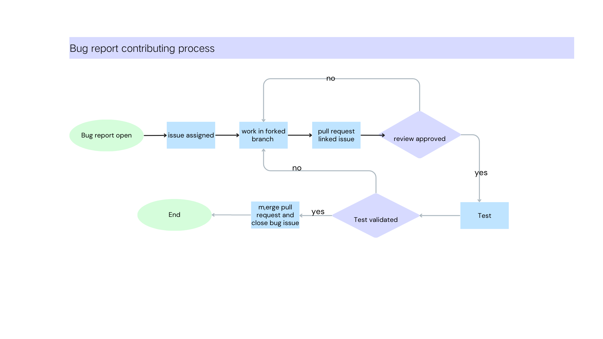
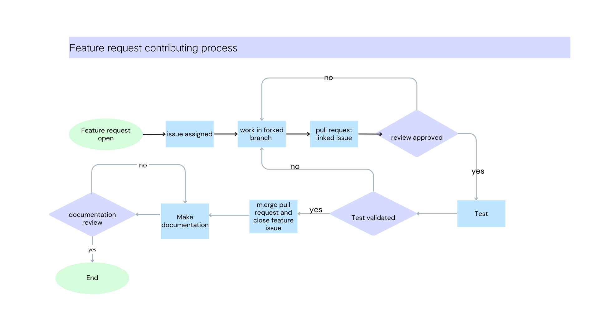

# Contributing

From opening a bug report to creating a pull request: every contribution is appreciated and welcome.

If you're planning to implement a new feature or change this repository, please [create an issue](https://github.com/websoft9/docker-library/issues/new/choose) first. This way we can ensure that your precious work is not in vain.

## Quick start for contributing new application

Below is the steps for contributing new application:  

1. Create issue by template **New docker compose request**
2. Waiting for Maintainers/owner Assessment until it is completed.
3. Install Websoft9 at your server or apply online development account from Websoft9
4. SSH to develoment host machine and running below command to upgrade latest Apps listing
   ```
   docker exec -it websoft9-apphub apphub upgrade apps --dev
   ```
5. Login to Websoft9 Console and install this application from **App Store**
6. Develop and test it by **[App compose](https://support.websoft9.com/en/docs/next/app-compose/)** at Websoft9 Console
7. Complete your issue checklist
8. Docker exec **websoft9-apphub** container and pull request to repository
   ```
   # sample for your, --appid get from Websoft9 Console, it not appname
   docker exec -it websoft9-apphub  apphub commit --appid "wordpress_o2qjz" --github_token "yourgithubtoken"
   ```

## Copilot-Assisted Development

GitHub Copilot can significantly accelerate the development of Docker Compose applications. Follow these steps to leverage AI assistance:

### Prerequisites

1. **Enable GitHub Copilot** in your IDE (VS Code, JetBrains, etc.)
2. **Reference Materials**: Provide Copilot with the official Docker Compose or container run command from the application's documentation
3. **Template Files**: Use `docker-library/template/docker-compose.yml` and `docker-library/template/.env` as base templates

### Development Workflow

#### Step 1: Gather Reference Information

Collect the following information about the target application:
- Official Docker Hub image name and tag
- Official docker-compose.yml example (if available)
- Official `docker run` command examples
- Environment variables and configuration requirements
- Volume mount requirements
- Network/port requirements
- Dependencies (database, cache, etc.)

**Example reference sources:**
```bash
# Official documentation URLs
https://hub.docker.com/_/[application-name]
https://github.com/[vendor]/[application]/docker-compose.yml
https://docs.[application].com/installation/docker
```

#### Step 2: Use Templates as Foundation

Open both template files to establish the standard structure:

```bash
# Copy templates to your workspace
cp docker-library/template/docker-compose.yml ./docker-compose.yml
cp docker-library/template/.env ./.env
```

**Key template components:**
- Standard service structure
- Volume naming conventions
- Environment variable patterns
- Network configuration
- Restart policies
- Health checks

#### Step 3: Prompt Copilot Effectively

Use clear, context-rich prompts to generate Docker Compose configurations:

**Example prompts:**

```yaml
# Prompt 1: Basic service definition
# Create a Docker Compose service for [ApplicationName] using image [imagename:tag]
# Based on the official docker run command: docker run -d -p 8080:80 [image]
# Follow the template structure from docker-library/template/docker-compose.yml

# Prompt 2: Environment variables
# Add environment variables for [ApplicationName] based on official documentation
# Reference: [paste official env vars documentation]
# Follow .env file format from docker-library/template/.env

# Prompt 3: Volume configuration
# Configure persistent volumes for [ApplicationName]
# Data directory: /app/data
# Config directory: /app/config
# Use named volumes following Websoft9 conventions

# Prompt 4: Dependencies
# Add [database-name] service as dependency for [ApplicationName]
# Configure database connection environment variables
# Set up proper service dependencies and health checks
```

#### Step 4: Iterate with Copilot

Provide Copilot with context for refinements:

```yaml
# Context: This is for Websoft9 docker-library
# Application: [app-name]
# Official reference: [paste docker-compose snippet or docker run command]
# Template reference: docker-library/template/docker-compose.yml
# 
# Task: Generate complete docker-compose.yml with:
# - Service name following convention: [appname]
# - Environment variables from .env file
# - Named volumes for persistence
# - Proper network configuration
# - Health checks
# - Restart policy: unless-stopped
```

#### Step 5: Validate Generated Configuration

After Copilot generates the configuration, verify:

- [ ] All environment variables are defined in `.env` file
- [ ] Volume paths match application requirements
- [ ] Port mappings are correct
- [ ] Service dependencies are properly configured
- [ ] Health checks are implemented (if applicable)
- [ ] Image tags use specific versions (not `latest`)
- [ ] Follows Websoft9 naming conventions

#### Step 6: Test Configuration

```bash
# Validate docker-compose syntax
docker-compose config

# Start services
docker-compose up -d

# Check service status
docker-compose ps

# View logs
docker-compose logs -f

# Test application access
curl http://localhost:[port]
```

### Best Practices for Copilot Development

1. **Provide Complete Context**
   - Always reference official documentation URLs
   - Include official docker-compose examples
   - Mention specific version requirements

2. **Use Structured Prompts**
   - Break complex applications into smaller components
   - Request one service at a time for complex setups
   - Explicitly mention template file adherence

3. **Iterative Refinement**
   - Start with basic service definition
   - Add environment variables
   - Configure volumes and networks
   - Add health checks and dependencies
   - Fine-tune resource limits

4. **Leverage Comments**
   ```yaml
   # Ask Copilot to generate service definition for [app]
   # Requirements:
   # - Image: [vendor/image:version]
   # - Ports: [8080:80]
   # - Volumes: [data-volume:/app/data]
   # - Environment: See .env file
   services:
     # Copilot will complete here
   ```

5. **Review and Customize**
   - Always review generated code for security issues
   - Verify default passwords are moved to .env
   - Check resource limits are appropriate
   - Ensure volume permissions are correct

### Example: Using Copilot to Create WordPress Compose

**Step 1: Provide reference**
```yaml
# Reference: https://hub.docker.com/_/wordpress
# Official docker run: 
# docker run -d -p 8080:80 \
#   -e WORDPRESS_DB_HOST=db \
#   -e WORDPRESS_DB_USER=wordpress \
#   -e WORDPRESS_DB_PASSWORD=secret \
#   wordpress:latest
#
# Task: Create docker-compose.yml based on template structure
```

**Step 2: Let Copilot generate**
Copilot will generate the service structure following the template pattern.

**Step 3: Refine with additional prompts**
```yaml
# Add MySQL database service for WordPress
# Configure with persistent volume
# Set up service dependency
```

**Step 4: Generate .env file**
```bash
# Generate .env file for WordPress and MySQL
# Include all sensitive credentials
# Follow template/.env format
```

### Troubleshooting Copilot Suggestions

If Copilot generates incorrect configurations:

1. **Be more specific**: Add exact version numbers, full image names
2. **Provide examples**: Paste official docker-compose snippets
3. **Reference templates**: Explicitly mention template file path
4. **Break it down**: Request smaller, focused changes
5. **Manual review**: Always validate against official documentation

### Additional Resources

- Template files: `docker-library/template/`
- Websoft9 documentation: https://support.websoft9.com
- GitHub Copilot best practices: https://github.com/features/copilot
- Docker Compose reference: https://docs.docker.com/compose/

---

By combining GitHub Copilot's AI capabilities with proper context and templates, you can dramatically speed up the development process while maintaining quality and consistency.

## Process diagram

[Bug report flow](https://www.canva.cn/design/DAFrBuGNCNs/-WGd-D0mQHBu1eZM07d8vQ/edit) as following:



[Feature request flow](https://www.canva.cn/design/DAFrBuGNCNs/-WGd-D0mQHBu1eZM07d8vQ/edit) as following:



## Development Specification

If you want to start to develop this repository, it is very useful for you to read [the develop documentation](docs/code_owner.md)

## Branch

This repository have these branchs:

- **dev branch**: Contributor only allow to fork [dev branch](https://github.com/Websoft9/docker-library/tree/dev) and pull request for it. 
- **main branch**: It is expected to contain code that is stable and ready for deployment.

> Maintainers/owner don't accept any pr to **main branch** from developer directly.

## Pull request

[Pull request](https://docs.github.com/pull-requests) let you tell others about changes you've pushed to a branch in a repository on GitHub.

#### When is PR produced?

- Contributor commit to dev branch

#### How to deal with PR?

1. [pull request reviews](https://docs.github.com/en/pull-requests/collaborating-with-pull-requests/reviewing-changes-in-pull-requests/about-pull-request-reviews)
2. Merge RP and CI/CD for it

## DevOps principle

DevOps thinks the same way **[5m1e](https://www.dgmfmoldclamps.com/what-is-5m1e-in-injection-molding-industry/)** for manufacturing companies

We follow the development principle of minimization, rapid release

### Version

Use _[[major].[minor].[patch]](https://semver.org/lang/zh-CN/)_ for version serial number and [version.json](../version.json) for version dependencies

### Artifact

Websoft9 use below [Artifact](https://jfrog.com/devops-tools/article/what-is-a-software-artifact/) for different usage:

- **Dockerhub for image**: Access [Websoft9 docker images](https://hub.docker.com/u/websoft9dev) on Dockerhub
- **Azure Storage for files**: Access [packages list](https://artifact.azureedge.net/release?restype=container&comp=list) at [Azure Storage](https://learn.microsoft.com/en-us/azure/storage/storage-dotnet-how-to-use-blobs#list-the-blobs-in-a-container)

### Tags

- Type tags: RRD, Bug, enhancement, Documetation
- Stages Tags: S-develop, S-fixed and all tags started with `S-`

### WorkFlow

Websoft9 use the [Github flow](https://docs.github.com/en/get-started/quickstart/github-flow) for development collaboration

## licensing

See the [LICENSE](https://github.com/Websoft9/docker-library/blob/main/LICENSE.md) file for our project's licensing. We will ask you to confirm the licensing of your contribution.

We may ask you to sign a [Contributor License Agreement (CLA)](http://en.wikipedia.org/wiki/Contributor_License_Agreement) for larger changes.
