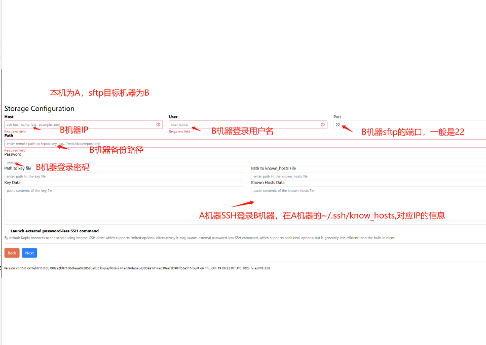

# Kopia

## FAQ

#### Menu Snapshots Policies 404?
Need add repository first

#### How create repository for remote wiht sftp?

server A ssh login server B, a piece of data containing ecdsa sha2 nistp256 of server A's /root/.ssh/known_hosts 

